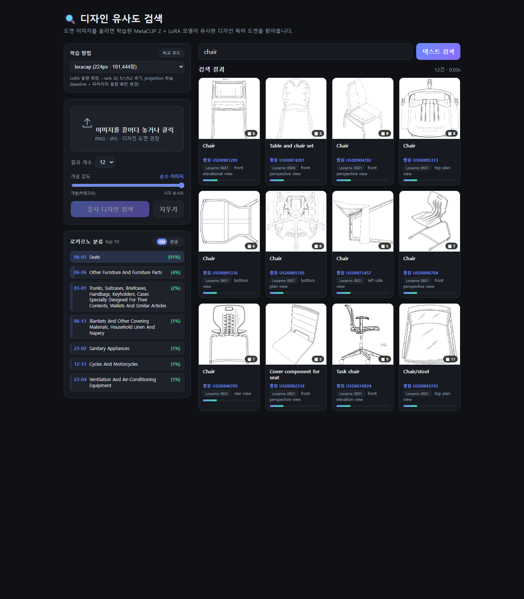
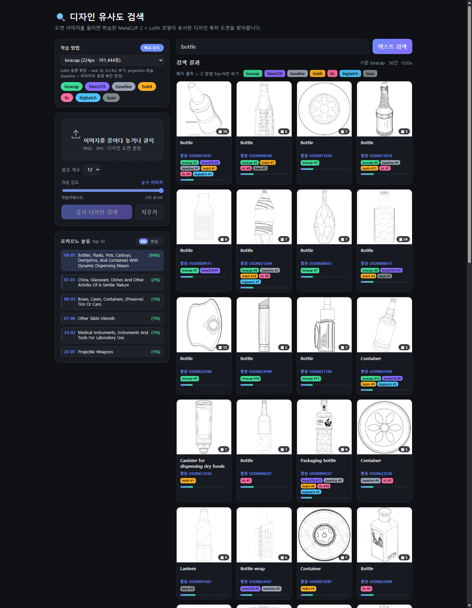

# ClipDesignSearch 학습 방법 비교: 최종 보고서

- 기간 2026-08-10 ~ 08-13 · 데이터 DeepPatent2 디자인 특허 도면 (전체 472,615장 / 비교용 부분집합 101,444장)
- 베이스 모델 MetaCLIP 2 (ViT-H, 224px) + LoRA · RTX 5090 32GB
- 산출물: 방법 레지스트리, 학습 방법 8종, 부분집합 실전 비교, 논문 재현 2건, 방법 선택·비교 웹 검색

## 1. 무엇을 만들었나

"여러 학습 방법을 같은 조건에서 비교하고, 웹 검색에서 방법을 골라 쓸 수 있게 한다"는
요청을 세 층으로 구현했다.

1. **비교 구조** — `configs/methods/<이름>.yaml` 한 장이 방법 하나를 완전히 기술하고,
   레지스트리가 `config.resolved.yaml`로 물화해 학습·평가·인덱스·서빙이 같은 설정을
   본다. 각 방법은 baseline 대비 **정확히 한 축만** 바꾸며, 이 단일 축 성립이 테스트로
   고정돼 있다 (전체 199 passed).
2. **방법 8종** — 선정 5종(hobit·tic·loracap·bigbatch·hires378) + 논문 입수 후 재수행
   2종(hobit2·vacsr) + baseline.
3. **웹 통합** — 7개 방법 인덱스를 동시 서빙, 방법 선택과 합집합 그리드 비교 UI.

## 2. 방법과 논문의 관계

| arm | 축 | 원 논문 | 관계 |
|---|---|---|---|
| hobit | 배치 구성 | HOBIT (ICML 2026 제출) | 원리 차용 (당시 전문 미확보) |
| hobit2 | 배치 구성 | 〃 | **충실 재현** (papers/ 입수 후) |
| tic | 손실 | FG-CLIP 2의 TIC | 계열 차용 + 실측 재설계 |
| loracap | 파라미터 용량 | LoRA (Hu et al. 2021) | 논문 자체의 ablation 축 |
| bigbatch | 유효 네거티브 수 | GradCache (Gao et al. 2021) | 충실 재구현 |
| hires378 | 입력 해상도 | FixRes / CLIP@336px 관행 | 확립된 축 적용 |
| vacsr | 유사도 표현 | VACSR (ICML 2026 제출) | **충실 재현** |

## 3. 실전 비교 결과 (부분집합 101,444장, 3에폭, 갤러리 9,938장)

Δ는 baseline 대비. I2I 쿼리 9,931개(쿼리 1개=0.01pp), T2I 쿼리 1,113개(1개=0.09pp).

| arm | I2I R@1 | I2I mAP | T2I R@1 | T2I mAP | 판정 |
|---|---|---|---|---|---|
| base (튜닝 전) | 0.7928 | 0.3668 | 0.2695 | 0.1627 | 기준점 |
| baseline | 0.8788 | 0.5373 | 0.3378 | 0.2508 | LoRA 자체 효과 I2I mAP +17pp |
| **loracap** | **0.8944** | **0.5704** | 0.3351 | 0.2527 | **I2I 승자 (+3.3pp)** |
| **hires378** | 0.8879 | 0.5678 | 0.3306 | **0.2568** | **유일한 양쪽 개선** |
| hobit | 0.8870 | 0.5601 | 0.3091 | 0.2369 | 트레이드오프 → 기각 |
| hobit2 | 0.8858 | 0.5568 | 0.2624 | 0.2167 | 논문 재현이 가설 반증 → 기각 |
| tic | 0.8749 | 0.5345 | 0.3136 | 0.2392 | 무승부 → 기각 |
| bigbatch | 0.8668 | 0.5128 | 0.3297 | 0.2471 | 스텝 수 교란 → 미판정 |
| vacsr | 0.7977 | 0.4175 | 0.0162 | 0.0207 | 구조적 부적합 → 기각 |

핵심 교훈 셋.

- **측정이 설계를 이긴다.** tic의 1차 설계, hobit의 스코어 방향, bigbatch의 autocast
  정밀도 축, vacsr의 σ̂ 헤드 - 네 번 모두 실측이 설계 가정을 뒤집었다.
- **논문 충실 재현이 항상 이기는 것은 아니다.** hobit2는 논문대로 고칠수록 나빠졌다
  (T2I −2.9 → −7.6pp). 원인은 도메인(제목 다대다 중복)이지 구현이 아니었고, 이는
  hardness 기반 배치 구성 축 자체의 기각 근거가 됐다.
- **이 데이터의 지배 변수는 false negative 구조다.** 제목 하나가 수백 디자인에 붙는
  다대다 관계가 hobit 계열의 T2I 붕괴, tic의 무승부, vacsr 선택의 배경 전부를
  관통한다. 이를 정면으로 겨냥한 vacsr조차 코사인 기하를 버리는 대가가 커서 기각됐다
  - 남는 방향은 코사인을 보존하는 계열(라벨 마스킹, PCME++류)이다.

상세 근거: [ablation_subset100k.md](ablation_subset100k.md) (arm별 해석·비용·재현 절차).

## 4. 웹 검색 통합

7개 방법(base·baseline·hobit·tic·loracap·bigbatch·hires378)의 인덱스를 동시 서빙한다.
같은 백본(224px)은 하나만 올리고 named adapter로 전환하며, hires378만 별도 백본이다.
인덱스 지문이 안 맞으면 그 방법만 비활성된다.

### 방법 선택 + 검색

셀렉터에서 방법을 고르면 그 방법의 어댑터·인덱스로 검색한다. 방법을 바꾸면 마지막
검색이 자동 재실행돼 방법 간 차이를 바로 볼 수 있다.

### 비교 모드: 합집합 그리드 + 방법 배지

비교 모드를 켜면 7개 방법이 기본 선택되고, **기준 방법의 순위대로 한 그리드**에
모든 방법의 결과 합집합이 놓인다. 카드마다 각 방법이 몇 위로 뽑았는지 컬러 배지가
붙고(좌측 선택 칩과 같은 색), 한 방법만 찾은 카드는 점선 테두리다. 배지를 클릭하면
그 방법의 top-N만 필터링한다.

로카르노 분포 패널은 결과와 같은 후보 풀·같은 혼합 점수로 집계되므로 개념 강도
슬라이더를 움직이면 분포도 따라 움직인다.

실행: `python webapp/server.py` (8000 선점 시 `PORT=8001`). 상세는 webapp/README.md.

## 5. 비용 총괄 (실측)

| 항목 | 시간 | 비고 |
|---|---|---|
| 6 arm × 3에폭 학습+평가 (1차) | 10h 18m | 무중단·무오류 |
| hobit2 재수행 | 2.6h | 학습 2.3h + 평가 |
| vacsr 재수행 | 1.1h | |
| 인덱스 7개 빌드 | 1.1h | 2스트림 병렬 (직렬 대비 약 2.4h 절감) |
| peak VRAM | 10.4~25.1 GiB | arm별 상이, 스필 0회 |

## 6. 남은 과제

- **풀규모(472,615장) 승격은 보류** (시간 제약, 사용자 결정). 재개 시: loracap과
  hires378의 `data.pairs`를 `data/pairs.jsonl`로 되돌리고 `--force` 재학습·재인덱싱.
  예상 약 30시간.
- GradCache의 실경로(train.py 2패스) 테스트 공백 - 그룹 스텝을 인코딩 콜러블 헬퍼로
  빼면 CPU 토이로 커버 가능.
- bigbatch 축 판정 - LR 스케일링 또는 스텝 맞춤 재실험 필요.
- tic 재설계 후보 - 범용 헤드 불용 목록 / 로카르노 기반 물품군 정의.
- 웹 서빙에서 vacsr류 재랭킹 층(코사인 top-K → 어댑터)은 방법이 살아나면 그때.
